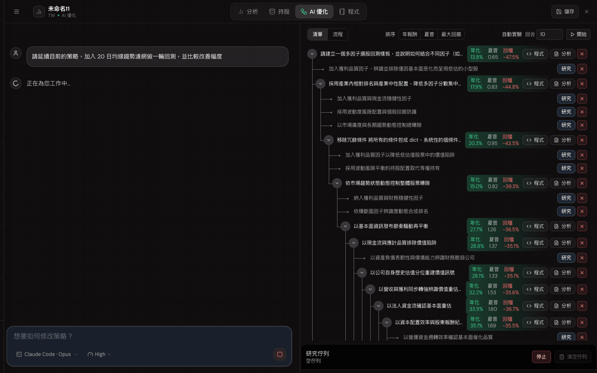
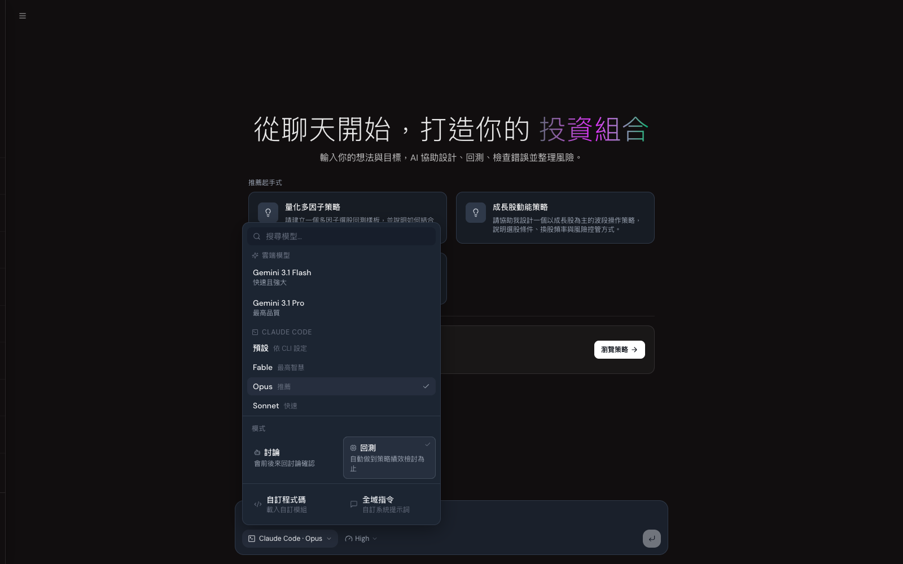
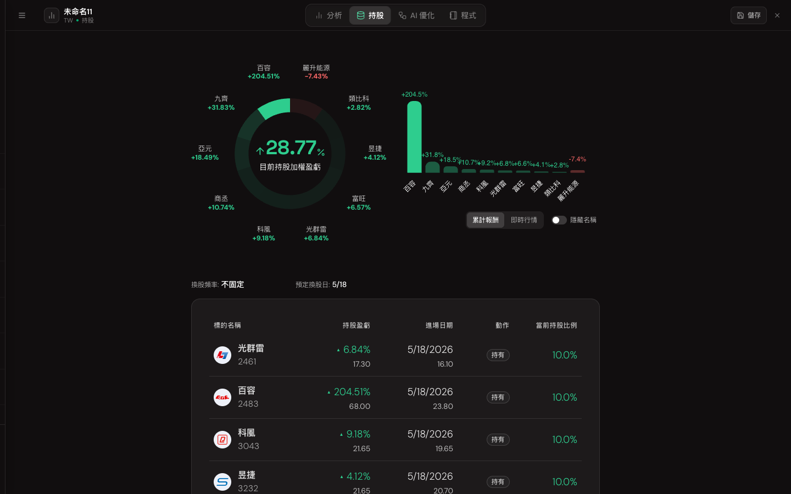

<div align="center">


# FinLab Desktop <sup>Beta</sup>

**用你自己的 Claude Code / Codex，在本機打造台股量化策略。**

聊天 → 回測 → 檢討 → 衍生新方向，AI 全自動完成整個研究循環。

[](https://github.com/finlab-python/finlab-desktop/releases/latest)
[](https://github.com/finlab-python/finlab-desktop/releases)


<br />



<sub>▲ 回測模式實錄：AI 自主撰寫策略、執行回測、記錄實驗筆記並持續演化。</sub>

</div>

<br />

## 為什麼是 Desktop 版？

雲端 AI 有用量上限，而你手上早就有最強的 agent。FinLab Desktop 把
**你自己的 Claude Code / Codex CLI 訂閱**接進 FinLab Studio —— 同一套介面、
同一批台股資料，但模型跑在你的帳號上，**沒有額外的 token 費用、沒有次數焦慮**。

|  |  |
| --- | --- |
|  **自帶 AI 訂閱** | 直接使用本機已登入的 Claude Code 或 Codex CLI，Claude Pro/Max、ChatGPT Plus/Pro 都能上工 |
|  **原生 Python 核心** | 首次啟動自動以 [uv](https://github.com/astral-sh/uv) 安裝獨立 Python 環境，真實 Jupyter 核心執行 `finlab` 回測——不是瀏覽器模擬 |
|  **實驗流程樹** | 每一輪回測自動封存績效、更新研究筆記、衍生下一批研究方向，策略演化一目瞭然 |
|  **執行中插話** | Agent 跑到一半直接輸入想法按 Enter，訊息即時送進進行中的回合，立刻調整方向 |
|  **Agent 自主管理環境** | 需要新套件？agent 自己 `uv pip install`；需要查資料？自己跑指令，全程在你的機器上 |
|  **自動更新** | 透過 GitHub Releases 自動檢查、背景下載新版本 |

<div align="center">
<br />

<br />
<sub>一鍵切換 Claude（Fable / Opus / Sonnet）、Codex（Sol / Luna / Terra，GPT-5.6）或雲端 Gemini，推理力度隨心調整。</sub>
<br /><br />

<br />
<sub>策略持股一目瞭然：加權盈虧、個股報酬與預定換股日。</sub>
<br />
</div>

## 下載

> **公開測試版（Beta）**：功能持續快速迭代中，遇到問題請直接按 App 內的「回報問題」或到 [Issues](https://github.com/finlab-python/finlab-desktop/issues) 告訴我們。

| 平台 | 下載 |
| --- | --- |
| macOS（Apple Silicon） | [FinLab-mac-arm64.dmg](https://github.com/finlab-python/finlab-desktop/releases/latest/download/FinLab-mac-arm64.dmg) |
| macOS（Intel） | [FinLab-mac-x64.dmg](https://github.com/finlab-python/finlab-desktop/releases/latest/download/FinLab-mac-x64.dmg) |
| Windows（x64） | [FinLab-windows-x64.exe](https://github.com/finlab-python/finlab-desktop/releases/latest/download/FinLab-windows-x64.exe) |

macOS 版本已完成 Apple 公證（notarized），下載後直接開啟即可。

## 快速開始

1. **安裝並登入** — 開啟 FinLab Desktop，以 Google 帳號登入你的 [FinLab](https://ai.finlab.tw/desktop) 帳號（需 **AI MAX 方案**）。
2. **Python 環境自動就緒** — 首次啟動自動安裝 uv、Python 與 `finlab` 套件，喝口咖啡就好。
3. **接上你的 agent** — 在 App 的引導畫面按「一鍵安裝」與「登入」即可，全程不用開終端機。偏好自己來的話：

   ```bash
   # Claude Code（Claude Pro / Max 訂閱）
   curl -fsSL https://claude.ai/install.sh | bash && claude auth login

   # Codex CLI（ChatGPT Plus / Pro 訂閱）
   curl -fsSL https://chatgpt.com/codex/install.sh | sh && codex login
   ```

4. 在輸入框描述你的策略想法，看著 agent 寫程式、跑回測、整理績效、提出下一步。

## 系統需求

- macOS 12+（Apple Silicon 或 Intel）或 Windows 10+
- [FinLab AI MAX 方案](https://ai.finlab.tw/desktop)
- 本機已登入的 Claude Code 或 Codex CLI（或使用內建雲端 Gemini 額度）

## 常見問題

**Q：會另外收 AI 費用嗎？**
不會。本機 agent 直接使用你既有的 Claude / ChatGPT 訂閱；FinLab 不經手、也不額外計費。

**Q：我的策略程式碼會外流嗎？**
策略在你的機器上執行；AI 對話走你自己的 CLI 帳號，與平常使用 Claude Code / Codex 寫程式相同。

**Q：跟網頁版 studio.finlab.finance 有什麼不同？**
同一套介面。桌面版多了本機 agent、原生 Python 核心與完整檔案／指令能力；網頁版使用雲端 Gemini。

---

<div align="center">
<sub>
<a href="https://finlab.finance">FinLab 官網</a> ·
<a href="https://studio.finlab.finance">FinLab Studio 網頁版</a> ·
<a href="https://doc.finlab.tw">finlab 套件文件</a> ·
<a href="https://github.com/finlab-python/finlab-desktop/issues">問題回報</a>
</sub>
</div>
